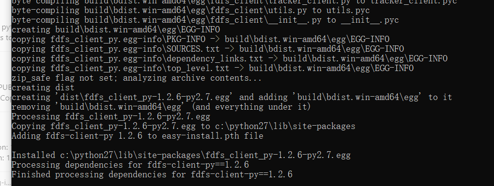

## Windows安装失败，问题解决：

网上下载 fdfs_client-py-master.zip 解压 或者直接用此文件夹

cd 到解压后的路径fdfs_client-py

敲入：python setup.py install

报错：

`error: Microsoft Visual C++ 14.0 is required.`

这时到控制面板确认此程序已安装，问题不在这。

于是百度，发现WIN下需要删除一些代码段：

1.解压后的fdfs_client-py-master\fdfs_client 目录下的storage_client.py

屏蔽第12行  # from fdfs_client.sendfile import *

```python
 1 #!/usr/bin/env python
 2 # -*- coding: utf-8 -*-
 3 # filename: storage_cliet.py
 4 
 5 import os, stat
 6 import struct
 7 import socket
 8 import datetime
 9 import errno
10 from fdfs_client.fdfs_protol import *
11 from fdfs_client.connection import *
12 # from fdfs_client.sendfile import *   屏蔽我~
13 from fdfs_client.exceptions import (
14     FDFSError,
15     ConnectionError,
16     ResponseError,
17     InvaildResponse,
18     DataError
19 )
```

2.解压后的fdfs_client-py-master 目录下的setup.py

屏蔽sdict字典中的   'ext_modules' 

```python
sdict = {
    'name': 'fdfs_client-py',
    'version': __version__,
    'description': 'Python client for Fastdfs ver 4.06',
    'long_description': long_description,
    'author': 'scott yuan',
    'author_email': 'scottzer8@gmail.com',
    'maintainer': 'scott yuan',
    'maintainer_email': 'scottzer8@gmail.com',
    'keywords': ['Fastdfs', 'Distribute File System'],
    'license': 'GPLV3',
    'packages': ['fdfs_client'],
    'classifiers': [
        'Development Status :: 1 - Production/Beta',
        'Environment :: Console',
        'Intended Audience :: Developers',
        'License :: GPLV3',
        'Operating System :: OS Independent',
        'Programming Language :: Python'],
    # 'ext_modules': [Extension('fdfs_client.sendfile',　　　　　　　　          屏蔽我~　　　　　　
    #                           sources=['fdfs_client/sendfilemodule.c'])],    屏蔽我~
}
```

完成以上两步，接着安装 pip install mutagen  和 pip install requests  ，不然会提示缺少此两个包。

最后 python setup.py install ，成功！

